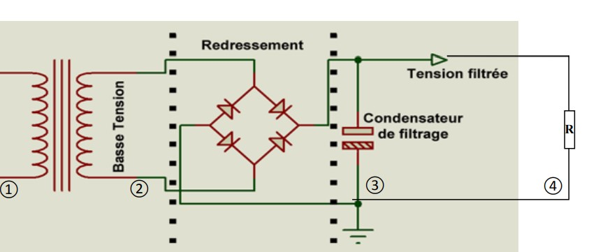

# Rapport de projet IOT - Pince ampèremétrique connectée
Antoine Loubersanes - Julien Beltrame IESE5

## Introduction

Dans le cadre de nos études à Polytech Grenoble dans la filière IESE nous avons du réaliser des projets IOT en binôme. Le projet qui nous a été proposé a pour objectif de mesurer le courant 
passant dans un fil à l'aide d'un pince ampèremétrique et de communiquer cette mesure grâce a une communication LoraWan. Pour cela il nous a été fournis : 

- Une pince ampèremetrique YHDC SCT-013-000
- Une carte LoRa-E5 Dev Board
- Une carte STM32FODISCOVERY

La pince nous permettra de mesurer le courant, la carte Lora communiquera sur le réseau Lora et la carte STM nous permet grâce à son ST-LINK de flasher notre programme sur le carte Lora.

## Analyse du marché

De nombreux fabricants proposent differents modèles de pince ampèremétrique. La plupart sont munis d'un écran affichant directement la valeur du courant mesuré. 
Il existe également plusieurs pinces ampèremetriques fonctionnent dans le cadre de la domotique qui utiliser diffèrents type de communication notemment en Bluetooth et 
en LoRaWan. Cependant ce genre de pince connectées sont relativement cher, environ 190€ pour la pince Lora. 

L'utilisation principale d'une pince ampèremétrique est la surveillance de consommation. Que ce soit dans un contexte privé ou industriel la consomation éléctrique est un enjeu de 
plus en plus d'actualité pour des raisons écologiques et économiques. On peut également imaginer une utilisation de maintenance qui permettrait de verifier à distance la consommation ou l'eventuel
arrêt d'un appareil.  

Il existe donc pour l'instant qu'un nombre limité de pinces ampèremétriques connecté et un nombre encore plus limité utilisant le réseau Lora. Ce projet est donc tout à fait perspicace 
et pourrait permettre de rendre plus accessible la mesure de courant via le réseau LoRa.

## Architecture globale du système
Notre système à une architecture globale relativement simple. On peut la voir comme une succession de 5 blocs :

Comme on peut le voir sur la figure ci-dessus, le premier bloc serait la pince ampèremétrique en elle-même, puis vient un bloc de traitement du signal permettant de réguler la tension en sortie de la pince. Ce bloc de traitement du signal communiquera ensuite une tension à la carte LoRa-E5-dev-board, dont on utilisera ensuite le CAN et le module Lora pour envoyer un message au réseau LoraWan du campus. L'utilisateur pourra ainsi récupérer les messages envoyés sur campusIOT.

Dans cette architecture, nous aurons principalement à travailler sur le bloc de traitement du signal et à développer le code permettant à la carte de communiquer sur le réseau Lora.

## Sécurité globale
Pour assurer la transmission par n'importe quel canal sans fil, il est important de mettre en place un système de chiffrement pour éviter que les données soient interceptées par un attaquant. Dans notre cas, les données que l'on transmet sont assez sensibles puisque connaître la consommation d'une maison par exemple, peut permettre de savoir si des personnes sont présentes à l'intérieur ou non, et potentiellement la cambrioler.

Nous comptons mettre en place une activation LoRaWan de type OTAA (Over The Air Activation). Ce type d'activation crée un canal de communication chiffré par AES128. Les communications de notre produit seront donc chiffrées et personne ne pourra les interpréter sans la clé de chiffrement.

## Respect de la vie privée du service
Le RGPD implique que l'utilisateur soient au courant des données conservée pour le fonctionnement du produit, du traitement de ses données et qu'il puisse en demander la suppression.

Dans notre cas, notre produit ne conserve aucune informations une fois le message LoRa envoyé, et il n'envoie aucun autre message que celui contenant la courant mesuré par la pince. Le produit étant clairement vendu comme communiquant, l'utilisateur est aussi mis au courant sans ambiguité que des données lui appartenant passent par le réseau LoRaWan. Néanmoins, il est l'unique destinataire de ces messages ce qui ne pose pas de problèmes de respect de la vie privée.

## Architecture matérielle de l'objet
### Bloc de traitement du signal
Très rapidement nous nous sommes rendus compte que récupérer la tension en sortie de la pince ampéremétrique allait être très compliqué. En effet, une pince ampéremétrique cherche à mesurer un courant indirectement grâce au champ magnétique qu'il induit (cf. schéma ci-dessous)

Mais, les équations de Maxwell impliquent que si un courant est alternatif, le champ magnétique induit le sera aussi. Or, pour notre projet nous allons mesurer le courant alimentant des appareils électroniques par la prise secteur. Donc, le courant mesuré par la pince sera alternatif (puisque le secteur fournit une tension et un courant alternatif).

Ceci pose un problème majeur : les microcontrôleurs ne peuvent pas lire une tension négative, sauf que la tension alternative du secteur oscille entre des valeurs positives et négatives... La seule solution consiste donc à mettre en place un circuit électronique appelé un **redresseur de tension**. Un tel circuit à un schéma électrique comme ceci :

- La **zone 1** montre le cable dont on veut mesurer le courant qui le traverse (rappel, le courant est alternatif).
- La **zone 2** montre la tension en sortie de la pince ampéremétrique (proportionnelle au courant mesuré donc alternative).
- La **zone 3** est l'ensemble du circuit électronique qui permet le redressement et le lissage de la tension en sortie de pince (cf. graphe ci-dessous). Les diodes permettent le redressement, et le condensateur de filtrage, le lissage de la tension.
- Ainsi, grâce à ce montage, en **zone 4**, on pourra lire sur la résistance, une tension continue proportionnelle à la tension alternative en sortie de pince.

Le graphe ci-dessous montre les tensions que l'on pourrait mesurer respectivement en sortie de pince, en sortie du pont de diode avant le condensateur et en sortie du condensateur (au borne de la résistance).

En résumé, sur la résistance (**zone 4**), la tension est quasi-continue, donc facilement utilisable sur un microcontrôleur.

En pratique, le montage du pont de diode, connecté à la carte LoRa-E5 est comme cela :

Et la tension alternative redressée à cette allure :

### Flashage de la carte
La carte Lora-E5-Dev-Board n'est pas équipée d'un st-link, donc nous utilisons le st-link de la carte STM32-FO-DISCOVERY comme pont permettant de flasher la E5.

## Proposition d'implémentation du logiciel embarqué (quel OS...)

Afin d'utiliser notre carte LoRa-e5 nous avons choisis d'utiliser RIOT OS. RIOT OS est un système d’exploitation gratuit et open source dédié à l’internet des objets. L’avantage de cet OS est qu’il supporte la plupart des microcontrôleurs 32, 16 ou 8 bits en étant “user friendly”. En effet, l’utilisation de Riot nécessite des
outils tout à fait classiques : programmation en C, C++ ou Rust, gcc/gdb… et permet de porter le code produit sur plusieurs produits puisque l’OS est indépendant de
l’hardware.

Pour permettre cette indépendance vis à vis du matériel, Riot utilise une première couche de code (cf. figure ci-dessus), propre à chaque
microcontrôleur, avant de passer sur la couche applicative. Cette première couche “Hardware” fait partie du code source de Riot, lors de la
compilation d’un programme, on doit indiquer pour quel microcontrôleur il doit-être compilé. En fonction de cela, le programme, une fois compilé, sera entièrement adapté au microcontrôleur en question. De même, RiotOS permet d’utiliser de nombreux dispositifs externes (capteurs, cartes filles…).

Enfin, comme de nombreux exemples de programmes sont disponibles avec RIOT OS, nous avons pu facilement compiler le programme d'exemple de RIOT permettant l'utilisation de LoRa et envoyer nos premiers messages. 

## Format des messages LoRaWan envoyé
Le contenu d'un message LoRaWan est structuré comme suit :

Les messages que l'on envoie sont encodés dans la partie **payload**. Ce message est uniquement composé d'une chaîne de caractère correspondant à la valeur (en mA) de courant mesurée par la pince. La taille du message variera donc en fonction de la valeur mesurée. Par exemple, si la valeur mesurée par la pince est de 100mA, il faudra 3 octets pour coder la chaîne de caractère "100". Evidemment, ceci n'est pas optimal car avec 8 bits nous aurions pu coder directement la valeur 100. A la place on a préféré par simplicité pour le prototype transformer "100" en chaîne de caractère.

## Logiciel embarqué (Ce qu'on a concrètement fait)

Le logiciel que contient actuellement notre prototype réalise principalement deux choses. Tout d'abord il utilise le convertisseur analogique numérique de la carte LoRa-E5 pour lire la tension en sortie du redresseur de tension que l'on a mise sur l'une de ses entrées analogique. Pour obtenir des résultats plus proche de la réalité, le programme calcule la moyenne sur 20 valeurs et la conserve. Ensuite il faut convertir cette valeur numérique issue du CAN en une valeur correspondant
au courant mesuré. Pour cela nous avons réaliser au préalable différentes mesures à l'aide d'un wattmètre afin de réaliser une courbe d'étalonnage de notre système:

Ce wattmètre nous a permis de connaitre le courant consommé à un instant t et nous récupérions simultanément la valeur mesuré par le CAN de notre carte LoRa. Grâce à cela nous avons tracé une droite
de régression linéaire : 

 

Le coefficient directeur de cette droite (315) nous permet dans notre programme de convertir la valeur donnée par le CAN en une valeur de courant en mA. 

Une fois la valeur du courant récupérée, le programme l'envoie sur le réseau LoRa. Après un premier échange d'authentification avec la gateway, notre prototype mesure le courant puis envoie un message contenant la valeur de celui-ci et cela, toutes les 20 secondes. A noter que ceci est un mode de démonstration, le mode nominal de fonctionnement du produit enverrai des messages toutes les 20 minutes pour avoir un meilleur rendement énergétique. 

Actuellement notre prototype n'est pas extremement précis, puisque l'on observe toujours un écart d'environ 15-20% entre la valeur mesurée par le Wattmetre et notre système. Comme cette erreur est constante, il ne s'agit que d'un offset, donc cela vient probablement de notre étalonnage qui n'est pas exact. L'avantage est qu'une erreur d'offset se règle très facilement logiciellement.

Concrètement, lorsque notre programme est en fonctionnement, nous avons l'affichage en direct dans le terminal des courants mesurés lorsque le message est envoyé :

## Métrique du logiciel embarqué (nb ligne, taille binaire...)

Tout notre projet est codé en C, nous nous sommes basé sur le système d'exploitation RIOT.
Nous pouvons retrouver les données de notre programme principal (main.c) sur l'image suivant :

Nous avons donc **129 lignes de code** effective. Le binaire qui résulte de la compilation de notre programme a une taille de **47,7 Ko**. Notre carte LoRa-e5 possède une memoire 
flash de **256 Ko**, nous avons donc largement la place pour rajouter d'éventuelles nouvelles fonctionnalités.

## Coût de production
Voici la liste exaustive des composants nécessaire à la fabrication de notre produit ainsi que les prix à l'unité et de gros associés :

|Materiel|Coût unitaire|Coût unitaire de gros (5000 unités)|Coût pour 5000 unités produites|
|---    |:-:    |:-:    |:-:    |
|Lora-E5-Dev-Board|30€|21€|105 000€|
|Pince YHDC SCT-013-000|3€|2,1€|12 000€|
|4 diodes|1,44€|0,815€|16 300€|
|1 résistance 1000Ohms|0,0617€|0,0156€|78€|
|1 super-condensateur 47uF35V|1,35€|0,945€|4 725€|
|1 condensateur 100uF|0,93€|0,19€|950€|
|Total|36€|25,06€|125 300€|

Ainsi, on obtient que pour une production de **5000 unités** de notre produit, il faudrait compter **125 300€**. En sachant que dans cette somme, on compte **83% du coût lié à la carte Lora-E5-dev-board**. En effet, cette carte n'est faite que pour du prototypage, donc en admettant que l'on fasse concevoir une carte électronique dédiée, on devrait pouvoir économiser beaucoup d'argent. Si une carte Lora-E5-dev-board coûte **21€** en prix de gros, on estime qu'une carte dédiée devrait pouvoir être produite pour **moins de 10€**. Ainsi, notre produit coûterai à l'unité **14,6€**, soit une somme de **73 000€ pour 5000 unités**.

Comme vu précèdemment dans la partie analyse de marché, les pinces ampéremétrique classique coûte environ **50€** et les prix s'envolent pour des pinces connectées au réseau Lora, jusqu'à **190€**. En arrondissant notre coût de production à **15€** l'unité (pour prendre en compte le coût de fabrication d'un boitier en plastique), notre produit est donc **13x** moins cher qu'une pince connectée !

## Coût de certification LoRa alliance

Afin de faire certifier notre produit par la LoRa Alliance, il est nécecessaire de faire partie de la Lora Alliance et de faire passer le test de certification à notre produit.
Pour faire partie de l'alliance il faut payer des frais à hauteur de **10 000$**, soit environ **9 200€**. Cependant une license du LCTT (LoRaWan Certification Test Tool) est gratuitement donnée aux 
membres de l'alliance, nous n'aurons donc à priori pas à payer de license supplémentaire. Il ne restera donc à payer que les frais de certification de produit qui coûtent **1000$**, soit en environ 
920€. Il faut donc compter **10 120€** pour faire certifier notre produit, en partant du principe que l'on ne fait pas partie de la LoRa alliance.   

## Estimation durée de vie batterie
Pour la démonstration de fonctionnement de notre produit, des messages LoRa sont envoyés toutes les 20 secondes après la mesure de courant. Dans cette configuration là, l'estimateur de durée de vie de batterie en ligne https://mclimate.eu/pages/lorawan-battery-calculator nous indique une durée de fonctionnement de 6 mois pour une batterie de 3500mAh. Cependant, dans un mode de fonctionnement nominal, nous mesurerions le courant toutes les 20 secondes avant d'effectuer une transmission LoRa toutes les 20 minutes, de cette manière la batterie durerait beaucoup plus longtemps.

## Analyse cycle de vie du produit
par ex : la pince est réutilisable car ça ne tombe pas en panne
Actuellement notre prototype a un impact limité sur l'environnement, rien n'est particulièrement polluant. De plus la pince ampèremétrique, étant composé de pratiquement uniquement un aimant, n'est à priori pas sensible à d'enventuelle panne et a temps de vie relativement long.  

Cependant si nous poussons plus loin le projet, nous aurons à produire un boitier contenant le matériel. La solution la plus économique est de créer les boitiers à partir de plastiques ce qui résulte forcement à un fort impact écologique. Une solution serait d'utiliser du bois mais cela augmenterait fortement les coûts de production. Il faudra également prendre en compte l'impact de la batterie, c'est sans aucun doute l'élément le plus polluant. Elles sont composées de matière première polluante et ne sont pas recyclable. 

## Avantage et inconvénient des produits concurrents
Les produits concurrent sont plus polyvalents dans le sens où ils peuvent mesurer des courants beaucoup plus important que notre produit. En effet, notre produit ne peut lire sur ses PINS d'entrées que des tensions infèrieure à sa tension d'alimentation (soit 3,3V). Néanmoins, cela devrait être suffisant pour mesurer des courants jusqu'à 2-3A (testé jusqu'à 1,5 ampères). Pour une utilisation générale notre produit est donc autant performant que ceux des concurrents. Par contre, notre pince connectée à un avantage énorme niveau prix puisqu'on l'estime comme étant environ 13 fois moins chère que certaines pinces ampéremétriques connectées.

## Conclusion
En conclusion, dans le cadre de ce projet, nous avons réalisé un système de mesure de courant connecté à l'aide d'une pince ampèremétrique. Ce système communique via le réseau LoRaWan. L'analyse du marché a montré qu'il existe peu de pinces connectées utilisant ce type de communication, et que celles-ci sont généralement chères. Notre système a une architecture simple qui permet de réguler la tension en sortie de la pince et de communiquer cette mesure sur le réseau LoRaWan. Nous avons également pris en compte la sécurité du système en utilisant un algorithme de chiffrement pour éviter les interceptions de données sensibles. Ce projet a été une opportunité pour nous de mettre en pratique nos connaissances en IOT et de découvrir de nouveaux outils tels que la carte LoRa-E5 Dev Board et RIOT OS.