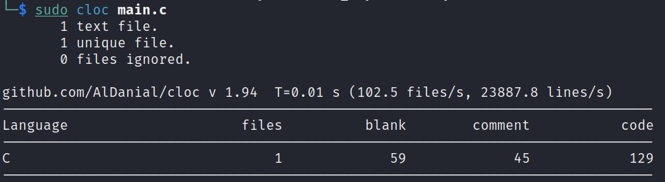

# Rapport de projet IOT - Pince ampèremetrique connectée

## Introduction

Dans le cadre de nos études à Polytech Grenoble dans la filière IESE nous avons du réaliser des projets IOT en binôme. Le projet qu'il nous a été proposé a pour objectif de mesurer le courant 
passant dans un fil à l'aide d'un pince ampèremetrique et de communiquer cette mesure grâce à du LoraWan. Pour cela il nous a été fournis : 

- Une pince ampèremetrique YHDC SCT-013-000
- Une carte Lora-E5 Dev Board
- Une carte STM32FODISCOVERY

La pince nous permettra de mesurer le courant, la carte Lora communiquera sur le réseau Lora et la carte STM nous permet grâce à son ST-LINK de flasher notre programme sur le carte Lora.

## Analyse du marché

De nombreux fabricants proposent differents modèles de pince ampèremetrique. La plupart sont munis d'un écran affichant directement la valeur du courant mesuré. 
Il existe également plusieurs pinces ampèremetriques fonctionnent dans le cadre de la domotique qui utiliser diffèrents type de communication notemment en Bluetooth et 
en LoraWan. Cependant ce genre de pince connectées sont relativement cher, environ 190€ pour la pince Lora. 

L'utilisation principale d'une pince ampèremetrique est la surveillance de consommation. Que ce soit dans un contexte privé ou industriel la consomation éléctrique est un enjeu de 
plus en plus d'actualité pour des raisons écologiques et économiques. On peut également imaginer une utilisation de maintenance qui permettrait de verifier à distance la consommation ou l'eventuel
arrêt d'un appareil.  

Il existe donc pour l'instant qu'un nombre limité de pinces ampèremetriques connecté et un nombre encore plus limité utilisant le réseau Lora. Ce projet est donc tout à fait perspicace 
et pourrais permettre de rendre plus accessible la mesure de courant via le Lora.

## Architecture globale du système

## Sécurité globale

## Respect de la vie privée du service

## Architecture matérielle de l'objet

## Coût de production

## Coût certification ETSI 

## Coût de certification LoRa alliance

## Proposition d'implémentation du logiciel embarqué (quel OS...)

## Format des messages LoRaWan voulu

## Electronique nécessaire pour le fonctionnement du produit

## Logiciel embarqué (Ce qu'on a concrètement fait)

## Métrique du logiciel embarqué (nb ligne, taille binaire...)

## Instrumentation du système (cb de temps pour mesure courant, cb tps pour envoie des datas)

## Estimation durée de vie batterie

## Analyse cycle de vie du produit
par ex : la pince est réutilisable car ça ne tombe pas en panne

## Avantage et inconvénient des produits concurrents

## Intégration faite (influxdb, home assistant...)

## Nombre lignes de code développé

