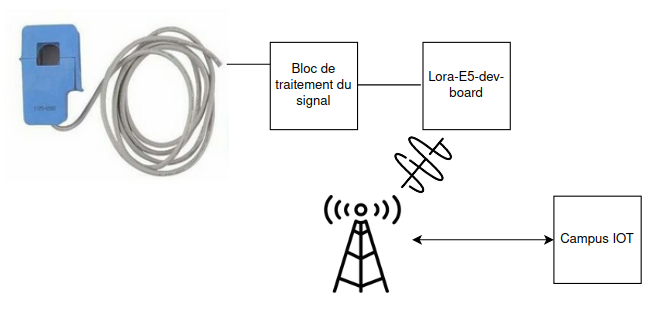
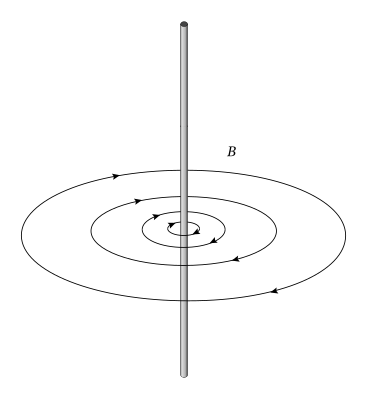
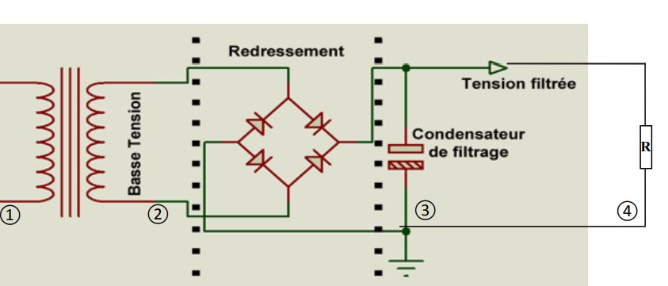
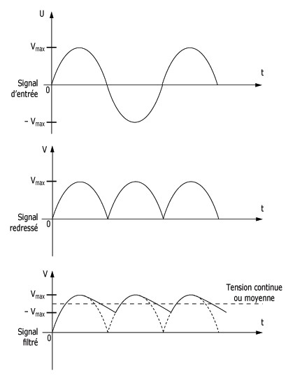
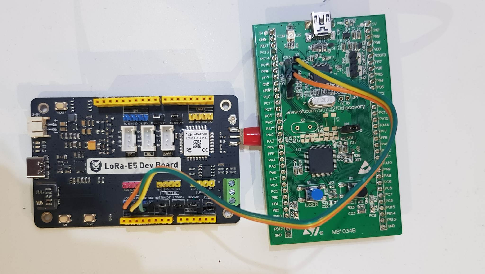

# Rapport de projet IOT - Pince ampèremétrique connectée
Antoine Loubersanes - Julien Beltrame IESE5

## Introduction

Dans le cadre de nos études à Polytech Grenoble dans la filière IESE nous avons du réaliser des projets IOT en binôme. Le projet qu'il nous a été proposé a pour objectif de mesurer le courant 
passant dans un fil à l'aide d'un pince ampèremetrique et de communiquer cette mesure grâce à du LoraWan. Pour cela il nous a été fournis : 

- Une pince ampèremetrique YHDC SCT-013-000
- Une carte Lora-E5 Dev Board
- Une carte STM32FODISCOVERY

La pince nous permettra de mesurer le courant, la carte Lora communiquera sur le réseau Lora et la carte STM nous permet grâce à son ST-LINK de flasher notre programme sur le carte Lora.

## Analyse du marché

## Architecture globale du système
Notre système à une architecture globale relativement simple. On peut la voir comme une succession de 5 blocs :

Comme on peut le voir sur la figure ci-dessus, le premier bloc serait la pince ampèremétrique en elle-même, puis vient un bloc de traitement du signal permettant de réguler la tension en sortie de la pince. Ce bloc de traitement du signal communiquera ensuite une tension à la carte Lora-E5-dev-board, dont on utilisera ensuite le CAN et le module Lora pour envoyer un message au réseau LoraWan du campus. L'utilisateur pourra ainsi récupérer les messages envoyés sur campusIOT.

Dans cette architecture, nous aurons principalement à travailler sur le bloc de traitement du signal et à développer le code permettant à la carte de communiquer sur le réseau Lora.

## Sécurité globale

## Respect de la vie privée du service

## Architecture matérielle de l'objet
### Bloc de traitement du signal
Très rapidement nous nous sommes rendus compte que récupérer la tension en sortie de la pince ampéremétrique allait être très compliqué. En effet, une pince ampéremétrique cherche à mesurer un courant indirectement grâce au champ magnétique qu'il induit (cf. schéma ci-dessous)

Mais, les équations de Maxwell impliquent que si un courant est alternatif, le champ magnétique induit le sera aussi. Or, pour notre projet nous allons mesurer le courant alimentant des appareils électroniques par la prise secteur. Donc, le courant mesuré par la pince sera alternatif (puisque le secteur fournit une tension et un courant alternatif).

Ceci pose un problème majeur : les microcontrôleurs ne peuvent pas lire une tension négative, sauf que la tension alternative du secteur oscille entre des valeurs positives et négatives... La seule solution consiste donc à mettre en place un circuit électronique appelé un **redresseur de tension**. Un tel circuit à un schéma électrique comme ceci :

- La **zone 1** montre le cable dont on veut mesurer le courant qui le traverse (rappel, le courant est alternatif).
- La **zone 2** montre la tension en sortie de la pince ampéremétrique (proportionnelle au courant mesuré donc alternative).
- La **zone 3** est l'ensemble du circuit électronique qui permet le redressement et le lissage de la tension en sortie de pince (cf. graphe ci-dessous). Les diodes permettent le redressement, et le condensateur de filtrage, le lissage de la tension.
- Ainsi, grâce à ce montage, en **zone 4**, on pourra lire sur la résistance, une tension continue proportionnelle à la tension alternative en sortie de pince.

Le graphe ci-dessous montre les tensions que l'on pourrait mesurer respectivement en sortie de pince, en sortie du pont de diode avant le condensateur et en sortie du condensateur (au borne de la résistance).

En résumé, sur la résistance (**zone 4**), la tension est quasi-continue, donc facilement utilisable sur un microcontrôleur.

### Flashage de la carte
La carte Lora-E5-Dev-Board n'est pas équipée d'un st-link, donc nous utilisons le st-link de la carte STM32-FO-DISCOVERY comme pont permettant de flasher la E5.

## Coût de production
Voici la liste exaustive des composants nécessaire à la fabrication de notre produit ainsi que les prix à l'unité et de gros associés :

|Materiel|Cout unitaire|Cout de gros (5000 unités)|Cout pour 5000 unités produites|
|---    |:-:    |:-:    |:-:    |
|Lora-E5-Dev-Board|30€|21€|105 000€|
|Pince YHDC SCT-013-000|3€|2,1€|12 000€|
|4 diodes|1,44€|0,815€|16 300€|
|1 résistance 1000Ohms|0,0617€|0,0156€|78€|
|1 super-condensateur 47uF35V|1,35€|0,945€|4 725€|
|1 condensateur 100uF|0,93€|0,19€|950€|
|Total|36€|25,06€|125 300€|

Ainsi, on obtient que pour une production de **5000 unités** de notre produit, il faudrait compter **125 300€**. En sachant que dans cette somme, on compte **83% du coût lié à la carte Lora-E5-dev-board**. En effet, cette carte n'est faite que pour du prototypage, donc en admettant que l'on fasse concevoir une carte électronique dédiée, on devrait pouvoir économiser beaucoup d'argent. Si une carte Lora-E5-dev-board coûte **21€** en prix de gros, on estime qu'une carte dédiée devrait pouvoir être produite pour **moins de 10€**. Ainsi, notre produit coûterai à l'unité **14,6€**, soit une somme de **73 000€ pour 5000 unités**.

Comme vu précèdemment dans la partie analyse de marché, les pinces ampéremétrique classique coûte environ **50€** et les prix s'envolent pour des pinces connectées au réseau Lora, jusqu'à **190€**. En arrondissant notre coût de production à **15€** l'unité (pour une production de 5000 unités), notre produit est donc **13x** moins cher qu'une pince connectée !
## Coût certification ETSI 

## Coût de certification LoRa alliance

## Proposition d'implémentation du logiciel embarqué (quel OS...)

## Format des messages LoRaWan voulu

## Electronique nécessaire pour le fonctionnement du produit

## Logiciel embarqué (Ce qu'on a concrètement fait)

## Métrique du logiciel embarqué (nb ligne, taille binaire...)

## Instrumentation du système (cb de temps pour mesure courant, cb tps pour envoie des datas)

## Estimation durée de vie batterie

## Analyse cycle de vie du produit
par ex : la pince est réutilisable car ça ne tombe pas en panne

## Avantage et inconvénient des produits concurrents

## Intégration faite (influxdb, home assistant...)

## Nombre lignes de code développé
